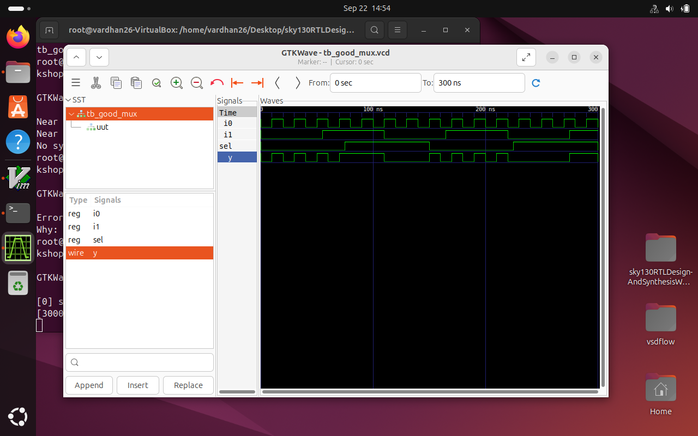
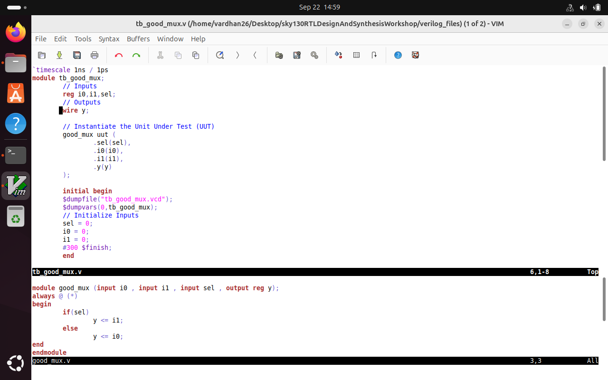
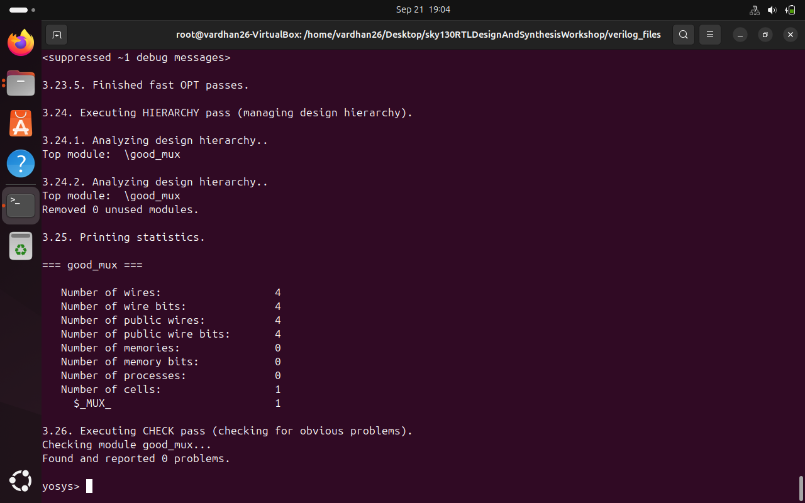
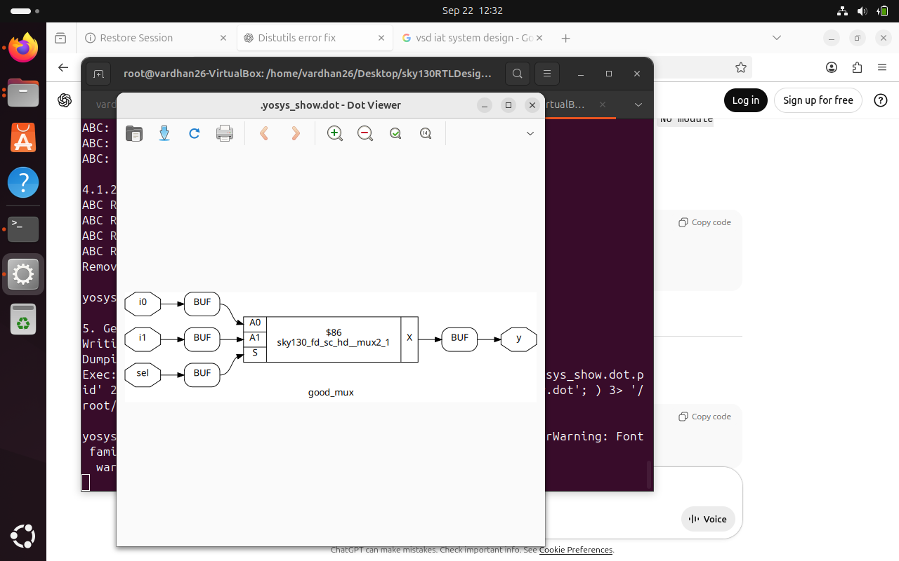
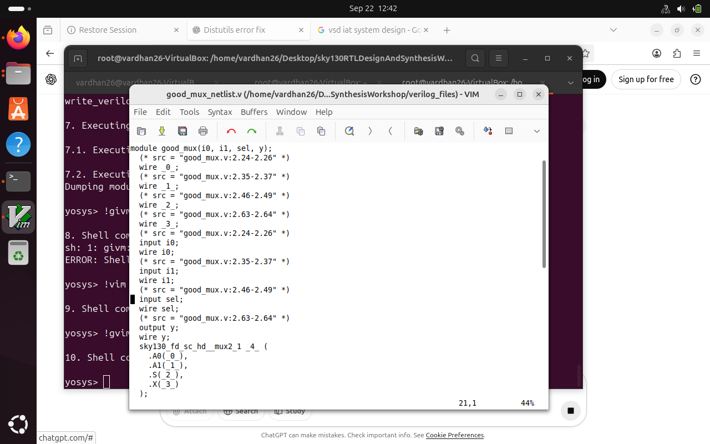
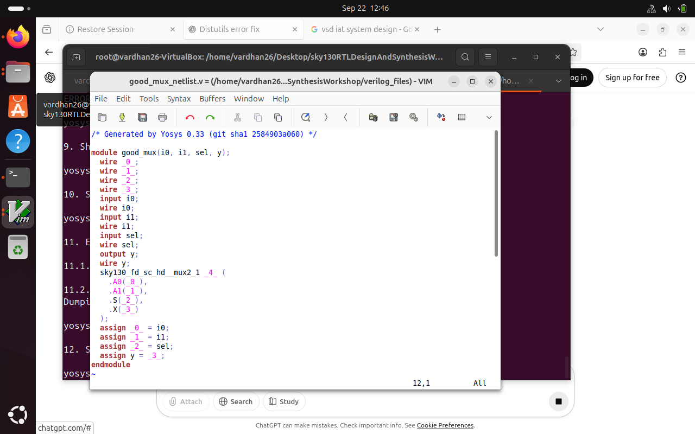

#  Week 1 – Introduction to Verilog RTL Design & Synthesis  

Welcome to **Week 1 of the Digital VLSI SoC RTL Design Workshop**.  
This session covers writing Verilog, simulating with **Icarus Verilog**, analyzing results using **GTKWave**, and synthesizing RTL designs with **Yosys** and the **Sky130 PDK**.  

---

##  Table of Contents
- Verilog & Testbench Basics  
- Lab Work with Icarus Verilog & GTKWave  
- Introduction to Yosys (Logic Synthesizer)  
- Understanding .lib Files  
- Lab Work with Yosys  
- Outcome  

---

## Verilog & Testbench Basics  

- **Design (RTL):** Hardware logic written in Verilog.  
- **Testbench:** Verification logic to test the design.  
- **Simulator:** Tool (e.g., Icarus Verilog) that mimics hardware behavior before fabrication.  

---

## Lab Work with Icarus Verilog & GTKWave  

Clone the workshop repository:  
```bash
$ git clone https://github.com/kunalg123/sky130RTLDesignAndSynthesisWorkshop.git  
$ cd sky130RTLDesignAndSynthesisWorkshop/verilog_files  
```


Simulate design + testbench:
```bash
$ iverilog good_mux.v tb_good_mux.v  
$ ./a.out  
$ gtkwave tb_good_mux.vcd
```


Open files in editor (design + testbench):  
  ```
$ gvim tb_good_mux.v -o good_mux.v
```


---

## Introduction to Yosys (Logic Synthesizer)  

Yosys is an **open-source synthesis tool** that converts RTL (Register Transfer Level) Verilog or VHDL code into a gate-level netlist that can be physically implemented on a chip. 
  

---

## Understanding .lib Files  

- A .lib file stores cell characteristics, including timing, power, and functionality.
- Synthesis tools use it to select the most suitable cells for the design.
- Helps achieve the right trade-off between performance, area, and power.

---

## Lab Work with Yosys  

Start Yosys:  
```bash
$ yosys
```
Read liberty library:  
```bash
$ read_liberty -lib ../lib/sky130_fd_sc_hd__tt_025C_1v80.lib  
```
Read design:  
```
$ read_verilog good_mux.v
```

Synthesize top module:  
```
$ synth -top good_mux
```


Map to standard cells:  
```bash
$ abc -liberty ../lib/sky130_fd_sc_hd__tt_025C_1v80.lib
$show
```


Generate netlist:  
```
$ write_verilog good_mux_netlist.v
```

Simplified netlist:  
```
$ write_verilog -noattr good_mux_netlist.v
```

---

##  Outcome  

By the end of **Week 1**, we have:  
- Learned **Verilog + Testbench basics**.  
- Simulated using **Icarus Verilog** and analyzed in **GTKWave**.  
- Synthesized RTL into **Sky130 gate-level netlist** with **Yosys**.  
- Understood the role of **.lib files** in optimization.  

**Full flow:**  
**RTL → Testbench → Simulation → Synthesis → Netlist** 

---
