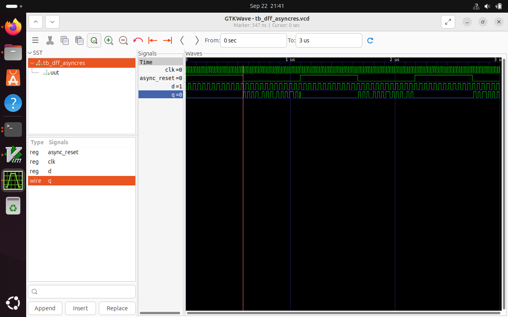
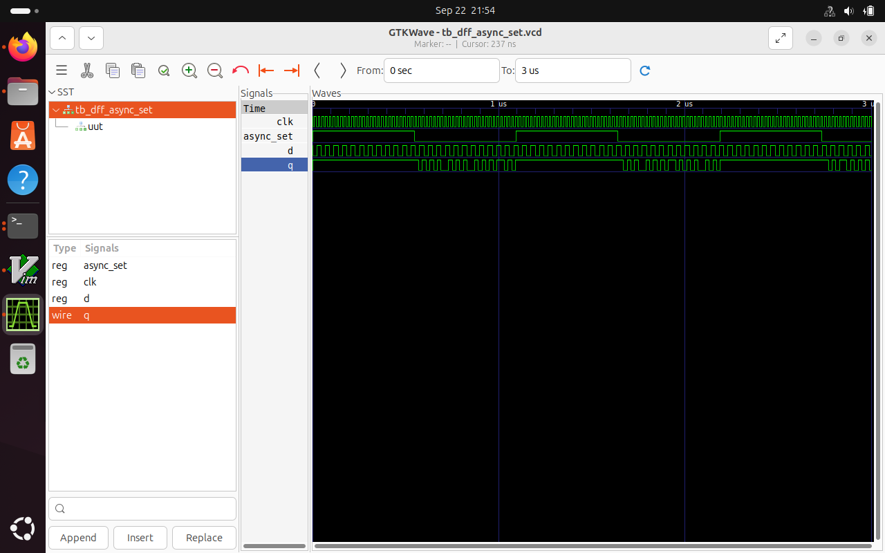
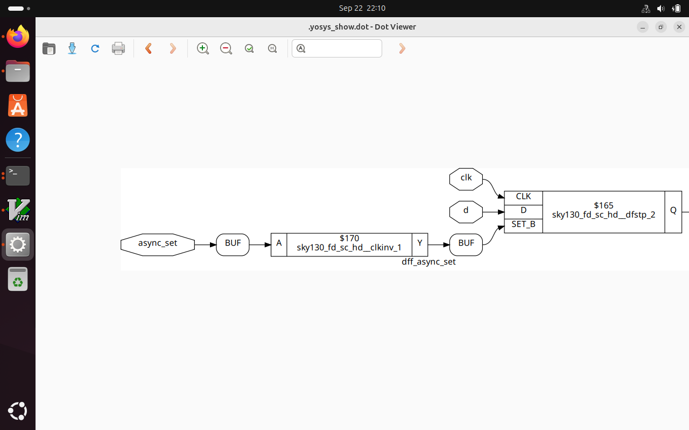

# Day 2 -Timing libs,hierarchical vs flat synthesis and efficient flop coding styles
 

This session focuses on **understanding standard cells, .lib files, and synthesis flow using Yosys** with the **Sky130 PDK**.  

---

## Table of Contents  
- Standard Cells Overview  
- .lib File Introduction
- Hierarchical vs Flat Synthesis
- Various Flop Coding Styles and optimization 
- Outcome  

---

##  Standard Cells Overview  
- Basic building blocks used in ASIC design (e.g., INV, AND, OR, DFF).  
- Provided by the **Sky130 PDK** as a library.  
- Each cell has **function, area, delay, and power** characteristics.  

---

## .lib File Introduction  
- The `.lib` file describes standard cell characteristics:  
  - Timing arcs  
  - Power consumption  
  - Area  
  - Functionality  
- Used by **synthesis tools** (like Yosys) to map RTL → standard cells.  

---

## Hierarchical vs Flat Synthesis


### Hierarchical Synthesis 
- Each submodule is synthesized separately, then connected at the top.
- Easier debugging, reuse, and modularity.
```bash
$yosys
$read_liberty -lib ../lib/sky130_fd_sc_hd__tt_025C_1v80.lib
$read_verilog multiple_modules.v
$synth -top top_module
$abc -liberty ../lib/sky130_fd_sc_hd__tt_025C_1v80.lib
$write_verilog hierarchical_netlist.v
show
```

### Flat Synthesis 
- Flattens the design by removing module hierarchy.
- Synthesizes entire design as one large netlist.
```bash
$yosys
$read_liberty -lib ../lib/sky130_fd_sc_hd__tt_025C_1v80.lib
$read_verilog multiple_modules.v
$synth -top multiple_modules
$abc -liberty ../lib/sky130_fd_sc_hd__tt_025C_1v80.lib
$flatten
$show
```


##  Various Flop Coding Styles and optimization 

### Synchronous Reset

- Reset happens only on clock edge.
```bash
$iverilog dff_syncres.v tb_dff_syncres.v 
$./a.out
$gtkwave tb_dff_syncres.vcd
```


### Asynchronous  Reset 
- Reset is applied immediately, independent of the clock.

```bash
$iverilog dff_asyncres.v tb_dff_asyncres.v 
$./a.out
$gtkwave tb_dff_asyncres.vcd
```


### Asynchronous  Set 
- Output responds immediately to set signal, ignoring the clock.

```bash
$iverilog dff_async_set.v tb_dff_async_set.v -o async_set.out
$./async_set.out
$gtkwave tb_dff_async_set.vcd
```


```bash
$yosys
$read_liberty -lib ../lib/sky130_fd_sc_hd__tt_025C_1v80.lib
$read_verilog dff_async_set.v
$synth -top dff_async_set
$abc -liberty ../lib/sky130_fd_sc_hd__tt_025C_1v80.lib
$write_verilog dff_async_set_netlist.v
$show
```


##  Various Flop Coding Styles and optimization 

### DFF_sync_reset


### ----------------------------------------------------------------------------------------------------------------


### ----------------------------------------------------------------------------------------------------------------


### ----------------------------------------------------------------------------------------------------------------


##  Outcome  

By the end of **Day 2**, we have:  
- Understood **standard cells** and **.lib files**.
- Understood waveforms through **gtkwave**.
- Performed RTL → Gate-level synthesis using **Yosys**.  
- Generated netlist mapped to **Sky130 cells**.  

**Flow Recap:**  
**RTL → .lib → Yosys → Synthesized Netlist**

---
