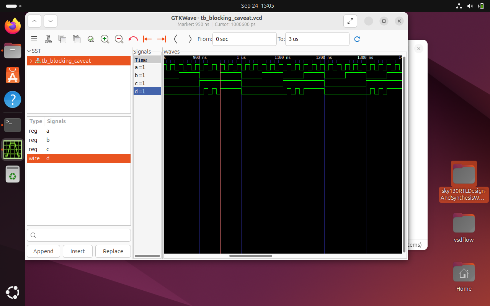

# Day 04: Gate-Level Simulation (GLS), Blocking vs Non-Blocking, and Synthesis–Simulation Mismatch

---

## Table of Contents

1. Overview
2. Gate-Level Simulation (GLS)
   * Workflow
   * GLS for 2:1 MUX
3. Synthesis–Simulation Mismatch
   * Missing Sensitivity List
   * Blocking vs Non-blocking Assignments
4. Summary

---

## Overview

This document demonstrates:

* How to perform Gate-Level Simulation using Icarus Verilog and Yosys.
* Common causes of synthesis-simulation mismatches:

  * Incomplete sensitivity list.
  * Improper use of blocking vs non-blocking assignments.

We use a simple 2:1 mux design and a bad mux example to illustrate these concepts.

---

## 1. Gate-Level Simulation (GLS)

Gate-Level Simulation involves simulating the **netlist** generated after synthesis instead of the original RTL. This helps verify that the synthesized hardware matches RTL logic.

### GLS Workflow

```bash
iverilog ../mylib/verilog_model/primitives.v ../mylib/verilog_model/sky130_fd_sc_hd.v design.v tb_design.v
./a.out
gtkwave tb_design.vcd
```

---

### GLS for 2:1 MUX

**RTL Code:**

```verilog
module mux2_1(input i0, input i1, input sel, output y);
  assign y = sel ? i1 : i0;
endmodule
```

#### RTL Simulation Output

> RTL Simulation shows expected behavior of a 2:1 MUX

<p align="center">
  
</p>

---

#### Gate-Level Simulation Output

> After synthesis with Yosys, the gate-level simulation waveform matches RTL behavior.

<p align="center">
  
</p>

#### Netlist View (Schematic)

<p align="center">
  
</p>

**Conclusion:** RTL and GLS outputs match — No synthesis-simulation mismatch.

---

## 2. Synthesis–Simulation Mismatch

### (a) Missing Sensitivity List

**Incorrect RTL Example:**

```verilog
module bad_mux(input i0, input i1, input sel, output reg y);
  always @(sel) begin
    if (sel)
      y <= i1;
    else
      y <= i0;
  end
endmodule
```

- The problem: `i0` and `i1` are **not** in the sensitivity list. RTL simulation behaves like a latch.
- Output `y` doesn’t respond to `i0`/`i1` changes unless `sel` changes.


---

#### Comparison

| RTL Simulation                       | Gate-Level Simulation                |
| ------------------------------------ | ------------------------------------ |
|  |  |

Mismatch occurred because the RTL omitted `i0`/`i1` from the sensitivity list.

**Fix:** Use `always @(*)` to include all relevant signals.

---

### (b) Blocking vs Non-Blocking Assignments

**Blocking Assignment (`=`)**

* Executes statements in order.
* Used for combinational logic.
* Can cause mismatches in sequential logic if not handled properly.

**Example (Incorrect for Sequential Logic):**

```verilog
always @(posedge clk) begin
  q = d;
  r = q;  // r gets the new value of q immediately (not real flip-flop behavior)
end
```

<p align="center">
  
</p>

<p align="center">
  
</p>

---
**Non-blocking Assignment (`<=`)**

* Updates all left-hand sides in parallel at the end of the time step.
* Proper for sequential logic.

**Correct Version:**

```verilog
always @(posedge clk) begin
  q <= d;
  r <= q;  // r gets the old value of q, matching hardware
end
```

**Best Practices:**

* Use `=` for purely combinational logic.
* Use `<=` in clocked always blocks for sequential logic.

---

## Summary

| Topic                                 | Key Takeaways                                                                            |
| ------------------------------------- | ---------------------------------------------------------------------------------------- |
| Gate-Level Simulation                 | Simulates post-synthesis netlist. Validates logical and potential timing behavior.       |
| Sensitivity List                      | Missing entries in RTL lead to mismatches. Use `@(*)` for combinational blocks.          |
| Blocking (`=`) vs Non-blocking (`<=`) | Blocking is sequential; non-blocking models hardware registers. Use appropriately.       |
| Synthesis Mismatch                    | Caused by bad coding style (e.g., latches, misuse of `=`). GLS helps detect these early. |

---


