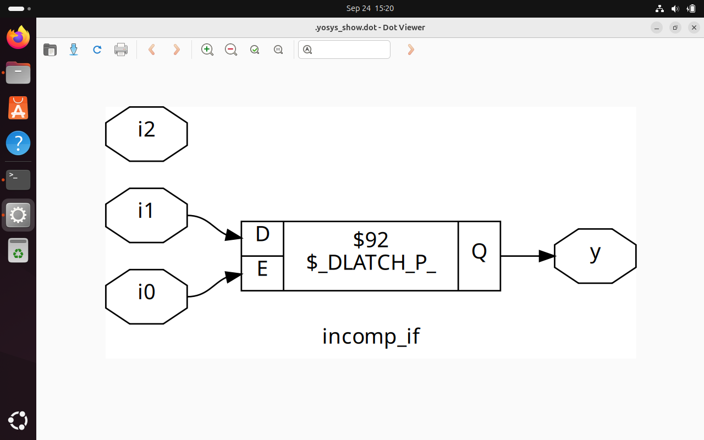
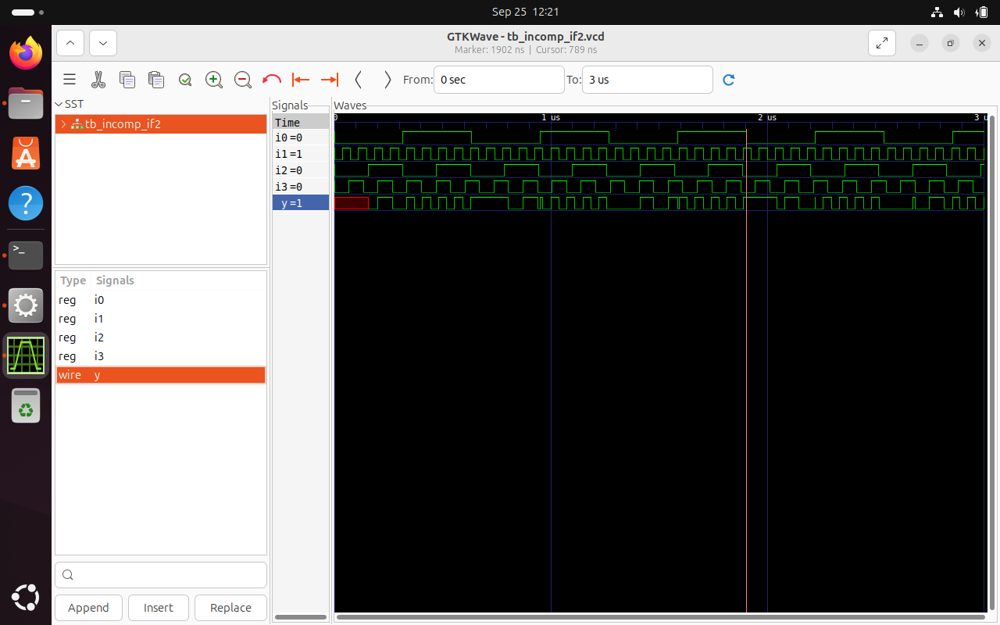

# Day-05: Good & Bad Coding Practices when dealing with if-else, Case and Loops  

---

## Table of Contents

-  If–Else Statements
-  Case Statements
-  Looping Constructs

---

## 1. If–Else Statements

**Introduction:**  
- The `if–elseif–else` chain is **priority-based**.  
- First condition to evaluate `true` is executed.  
- Commonly used in priority encoders and control logic.

**Syntax:**

```verilog
if (condition1)
    statement1;
else if (condition2)
    statement2;
else
    statement3;
````

**Important Notes:**

* If not all conditions are covered, the synthesizer may infer a **latch**, which is generally undesirable in synchronous designs.

---

### Example: Incomplete If Statement — Latch Inferred



**Simulation Output:**



Explanation: When `i0 = 0`, there is no assignment to output `Y`. Hence, the output retains its previous value — a latch is inferred.

---

### Example: Incomplete Multiple Conditions — Latch Inferred


**Simulation Output:**


Explanation: When both `i0 = 0` and `i2 = 0`, none of the branches execute, resulting in `Y` being latched to its previous value.

---

## 2. Case Statements

**Introduction:**

* A `case` compares an expression to multiple values.
* `casex` and `casez` support wildcard-style comparisons.
* If not all possibilities are handled (or no `default` is provided), a latch may be inferred.

**Syntax:**

```verilog
case (expression)
    value1: statement1;
    value2: statement2;
    default: statementN;
endcase
```

---

### Example: Complete Case Statement (Safe)


Explanation: All input combinations are covered, and a `default` is present. No latch is inferred.

---

### Example: Incomplete Case Statement — Latch Inferred


**Simulation Output:**


Explanation: Inputs `2'b10` and `2'b11` are not handled in the case block. As a result, the output holds its previous value (latch behavior).

---

### Example: Partial Assignment in Case — Latch Inferred


Explanation: In some case branches, not all output variables are assigned. Unassigned variables retain their previous values, causing latch inference.

---

### Example: Overlapping Case Items — Simulation vs Synthesis Mismatch


Explanation: Wildcard values like `2'b1?` can overlap, leading to multiple matches. Simulation and synthesis tools may handle this differently, causing mismatches.

---

## 3. Looping Constructs

### `for` Loop (Inside always block)

Used for repeated behavior like accumulation or indexed access. Does **not** result in repeated hardware.

```verilog
always @(posedge clk) begin
    for (i = 0; i < N; i = i + 1)
        array[i] = array[i] + 1;
end
```

---

### `generate for` Loop (Outside always block)

Used to instantiate repeated hardware (e.g., gates, adders).

```verilog
genvar i;
generate
    for (i = 0; i < N; i = i + 1) begin : block_name
        your_module inst_name (
            .port1(...),
            .port2(...)
        );
    end
endgenerate
```

---

### Use Cases of Loops in Hardware Design

* Multiplexers (4:1, 8:1)
* Decoders and Encoders
* Demultiplexers
* Ripple Carry Adders
* Register Banks
* Repetitive structures using `generate for`

Ensure that both RTL simulation and gate-level simulation results match when using loops.

---

## Summary

| Construct        | Good Practice                             | Bad Practice                                |
| ---------------- | ----------------------------------------- | ------------------------------------------- |
| If–Else          | Cover all conditions and outputs          | Incomplete blocks lead to latch inference   |
| Case             | Use default and assign all outputs        | Missing values or assignments infer latches |
| Case (wildcards) | Avoid overlapping wildcard matches        | May cause synthesis-simulation mismatch     |
| for (in always)  | Use for indexed computation or simulation | Don't expect replicated hardware            |
| generate for     | Use for scalable hardware instantiations  | Must be outside always block                |

---

